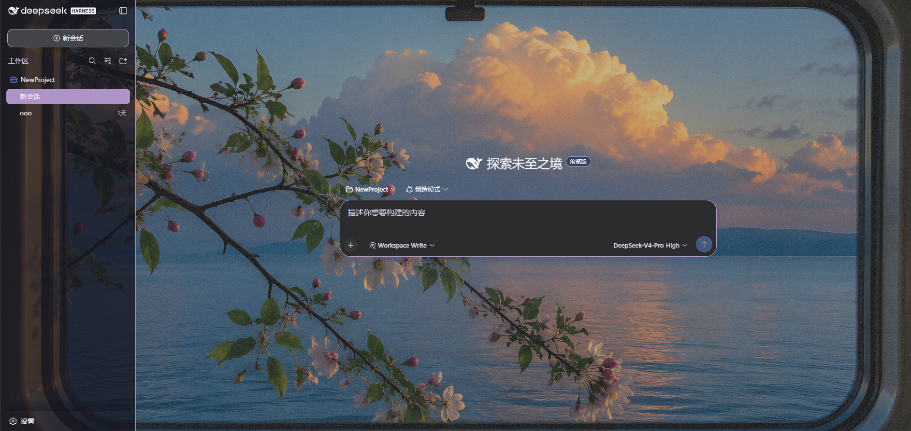
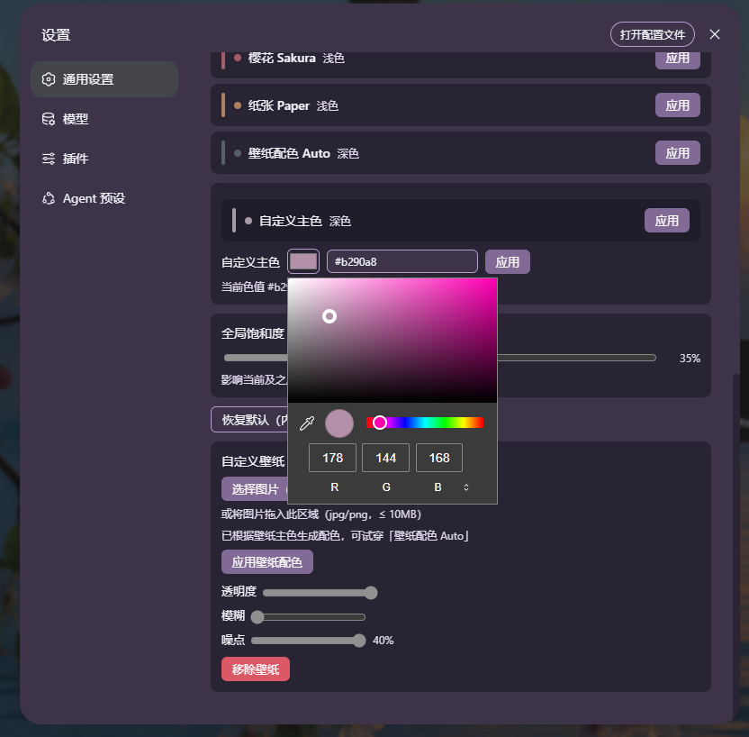

# my-skin

DeepSeek Harness 的皮肤扩展插件：一套完整的主题 token 换肤方案，内置壁纸智能取色、自定义主色、全局饱和度与沉浸式滑条预览。

## 功能特性

- **5 套预设皮肤**：紫夜 / 深海 / 午夜 / 樱花 / 纸张，覆盖深色与浅色，每套生成完整的 `--dsw-alias-*` token 集。
- **壁纸智能取色**：上传或拖拽图片（`image/*`、≤10MB），客户端 K-means 聚类提取主色，自动生成「壁纸配色 Auto」皮肤；支持透明度、模糊、噪点三个滑条（噪点为 SVG feTurbulence 灰度层，0–40%）。
- **自定义主色**：原生取色器 + 文本输入（`#RRGGBB` / `R,G,B`），校验失败提示且不应用；与壁纸 Auto 相互独立、可并存。
- **全局饱和度**：0–200% 滑条，实时作用于所有皮肤的主色再生成 token。
- **更顺手的皮肤交互**：单击试穿、双击直接应用、左侧色条与 hover 强调、试穿横幅淡入淡出、「已应用 ✓」短暂反馈。
- **沉浸式滑条预览**：拖动任意滑条时，设置弹窗（含遮罩与导航）整体隐藏，露出主界面，只保留当前滑块在原位；松开即恢复。
- **持久化**：激活皮肤、壁纸（含透明度/模糊/噪点）、Auto 主色、饱和度、自定义主色全部存 localStorage，启动自动恢复。

## 截图预览

  
  

## 安装 / 使用

1. 将 my-skin 文件夹放入 deepseek-harness/ 根目录
2. 在 deepseek-harness 根目录执行：
   pnpm dsh plugin --profile web add -w ./my-skin
3. 重启 dsh web
4. 打开「设置 → 通用」的 my-skin 区域切换皮肤

## 兼容性

- 面向 DeepSeek Harness web 客户端（Cordis 动态包，浏览器半区）。
- 现代 Chromium 系浏览器。

## License

GPL-3.0

## 开发状态

后续功能还在持续开发中，欢迎反馈与建议。

## 作者

- 小红书：@Epho
- GitHub: https://github.com/fthuu

## English Version

# my-skin

A skin extension plugin for DeepSeek Harness. It provides a complete theme token system with wallpaper-based smart color extraction, custom primary color, global saturation, and immersive slider preview.

## Features

- **5 preset skins**: Violet / Ocean / Midnight / Sakura / Paper, covering both dark and light schemes. Each preset generates a complete set of `--dsw-alias-*` tokens.

- **Wallpaper smart color extraction**: Upload or drag an image (`image/*`, ≤10MB). Client-side K-means clustering extracts the dominant color and auto-generates a "Wallpaper Auto" skin. Supports three sliders: opacity, blur, and noise (SVG feTurbulence grayscale layer, 0–40%).

- **Custom primary color**: Native color picker + text input (`#RRGGBB` / `R,G,B`). Invalid inputs show a warning and are not applied. Works independently alongside the Wallpaper Auto skin.

- **Global saturation**: 0–200% slider that reapplies to the primary color of all skins in real time.

- **More responsive skin interaction**: Single-click to try on, double-click to apply directly, left color bar with hover emphasis, try-on banner with fade in/out, and a brief "Applied ✓" feedback.

- **Immersive slider preview**: While dragging any slider, the settings modal (including overlay and navigation) hides, revealing the main interface with only the slider remaining in place. The UI restores when released.

- **Persistence**: Active skin, wallpaper (opacity/blur/noise), Auto primary color, saturation, and custom primary color are all stored in localStorage and auto-restored on startup.

## Installation

1. Place the `my-skin` folder into the `deepseek-harness/` root directory.

2. In the `deepseek-harness/` root directory, run:
pnpm dsh plugin --profile web add -w ./my-skin

3. Restart `dsh web`.

4. Open Settings → General and find the my-skin section to switch skins.

## Compatibility

- Built for the DeepSeek Harness web client (Cordis dynamic bundle, browser half)
- Modern Chromium-based browsers

## License

GPL-3.0

## Development Status

More features are in active development. Feedback and suggestions are welcome.

## Author

- Xiaohongshu/Rednote: @Epho
- GitHub: https://github.com/fthuu

